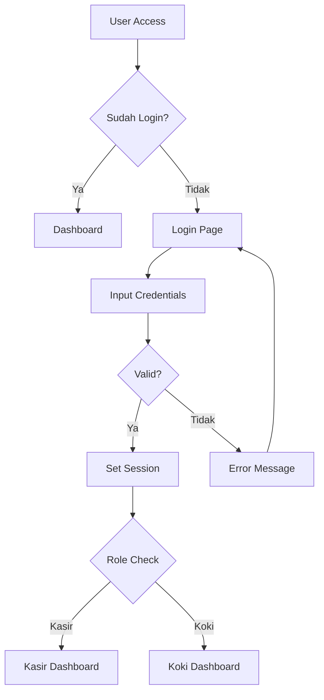
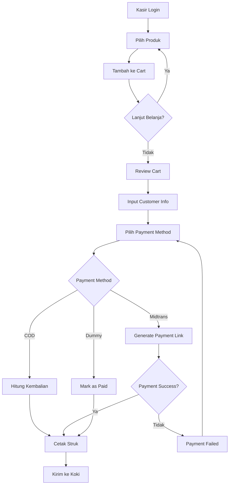
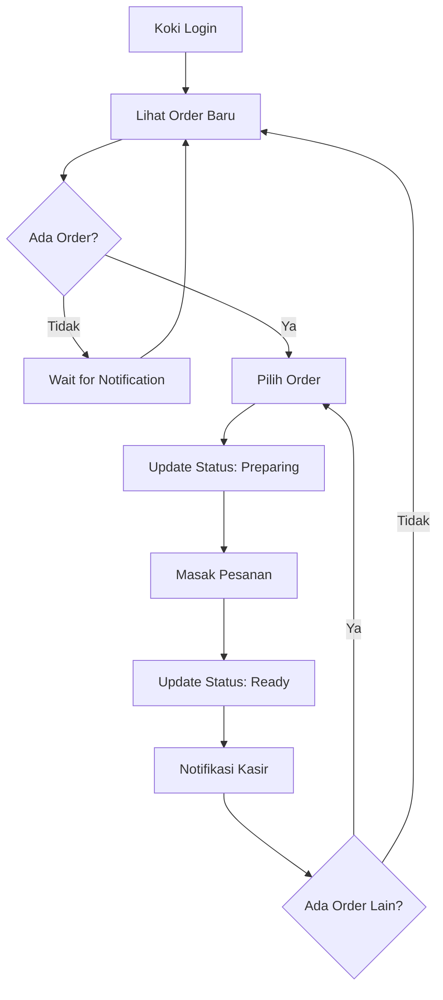
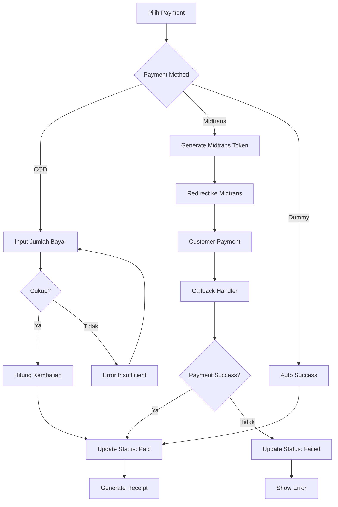
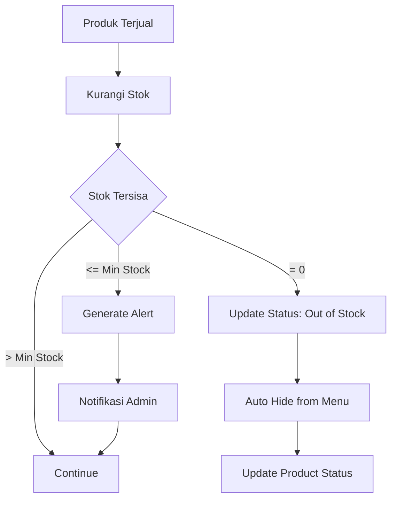
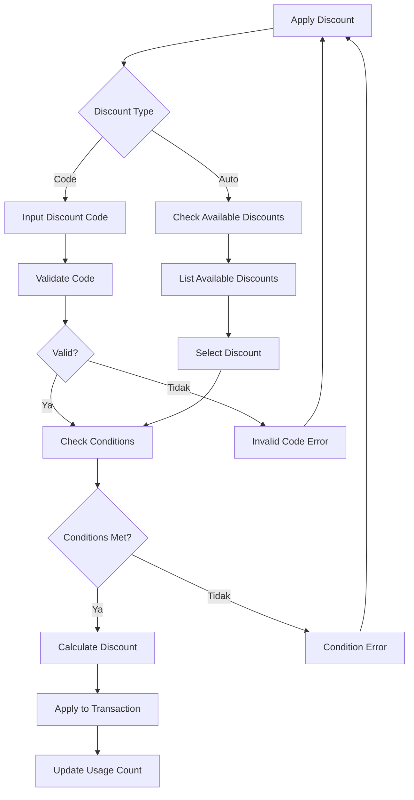
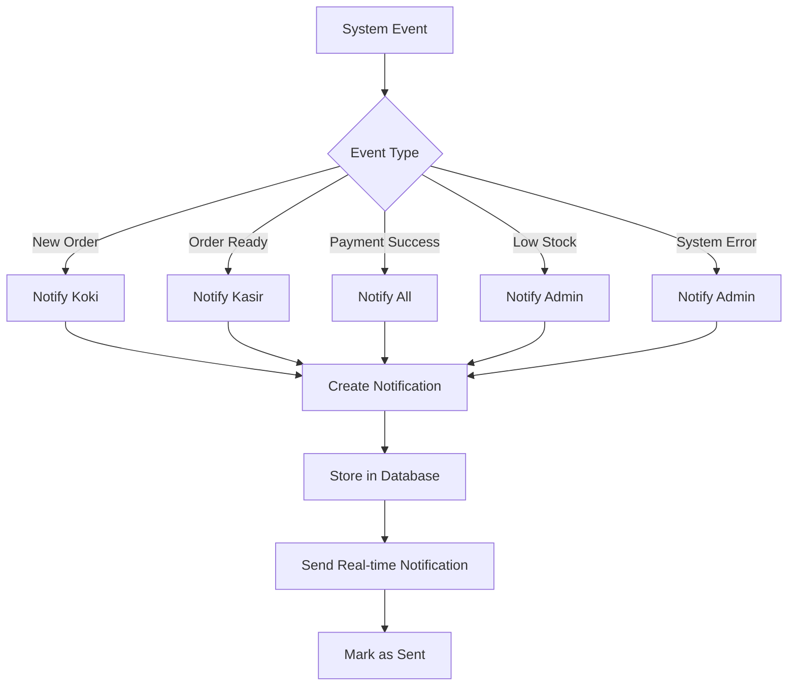
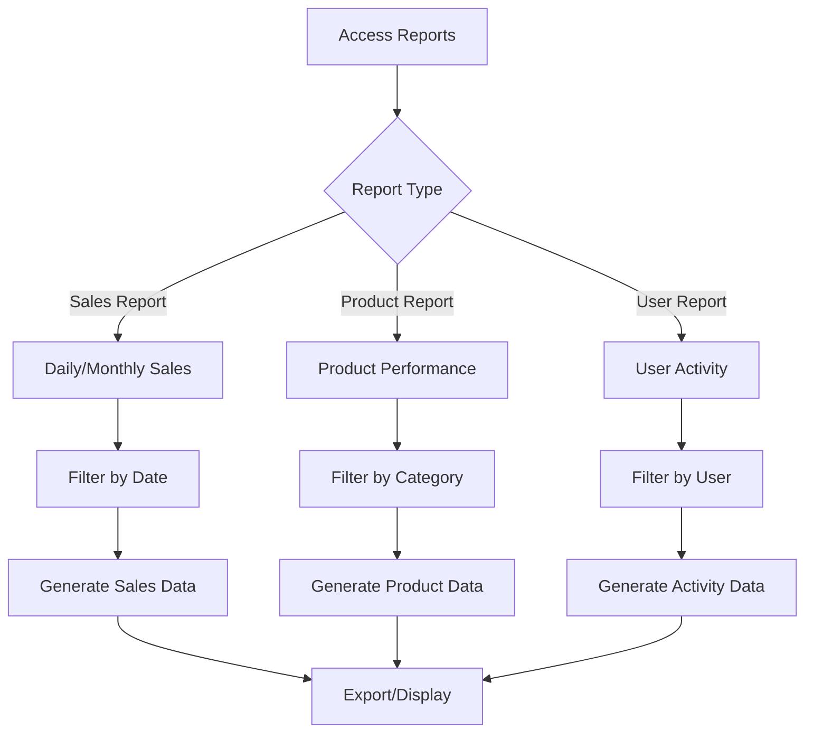
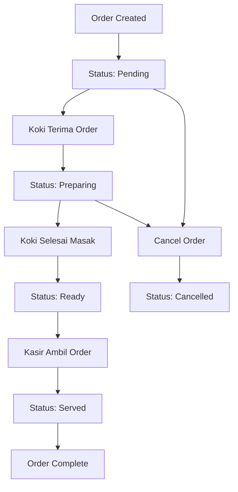
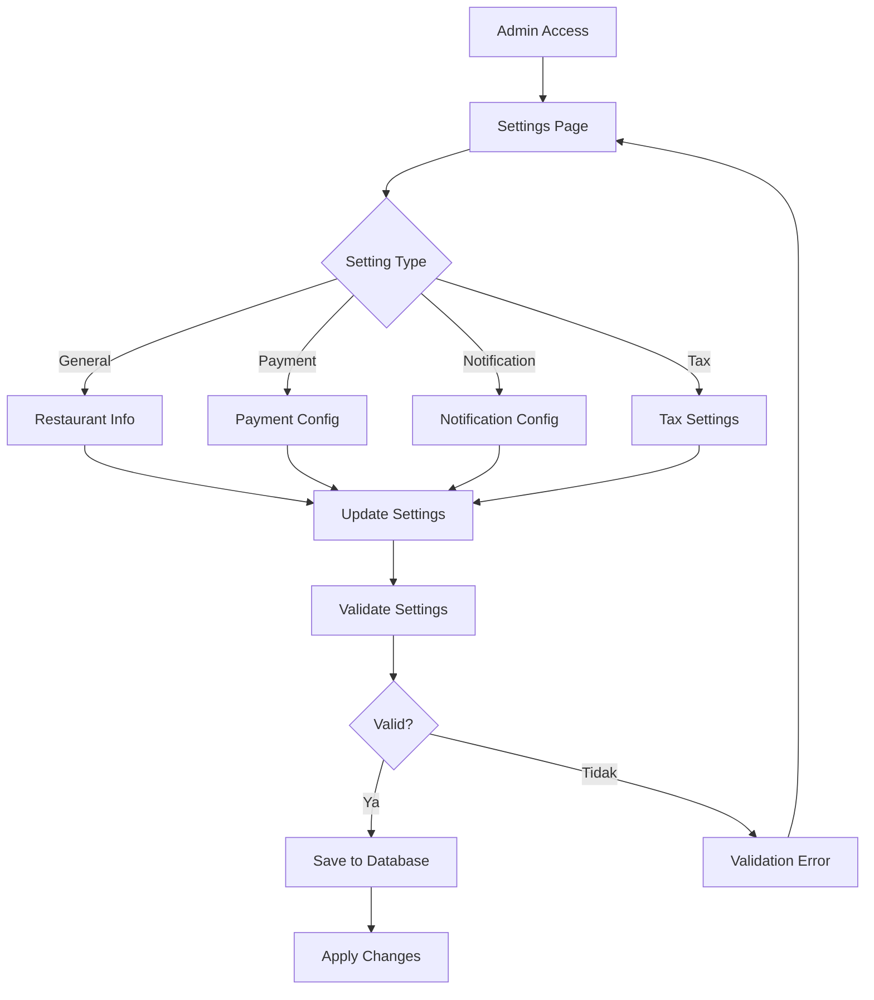

# 📊 Flowchart Sistem Kasir Restaurant

## 🔐 Alur Autentikasi

## 🛒 Alur Transaksi Kasir

## 👨‍🍳 Alur Dapur (Koki)

## 💰 Alur Payment Processing

## 📦 Alur Manajemen Stok

## 🎯 Alur Sistem Diskon

## 🔔 Alur Notifikasi

## 📊 Alur Reporting

## 🔄 Alur Order Status

## ⚙️ Alur Konfigurasi Sistem

---

**Flowchart ini menggambarkan alur kerja utama dalam sistem kasir restaurant. Setiap alur dirancang untuk memberikan pengalaman pengguna yang optimal dan efisiensi operasional.**
